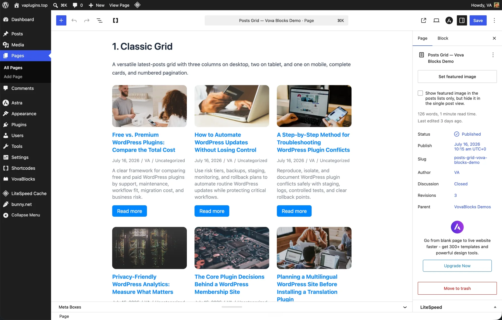
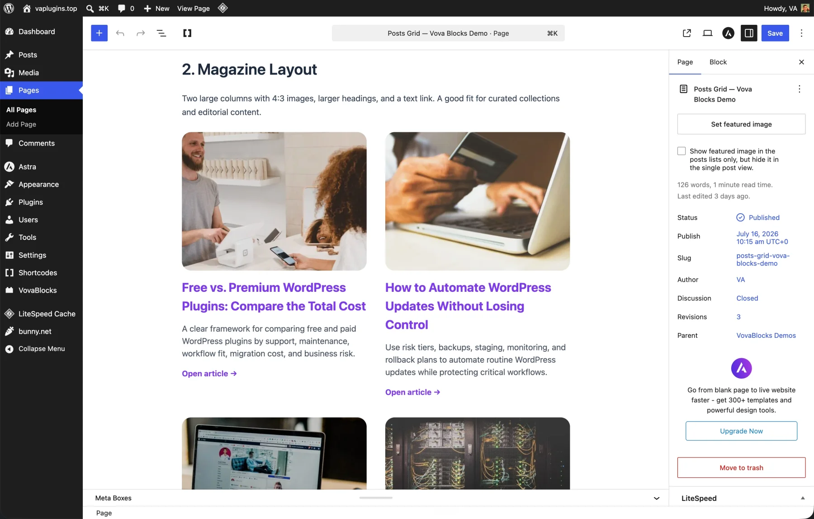
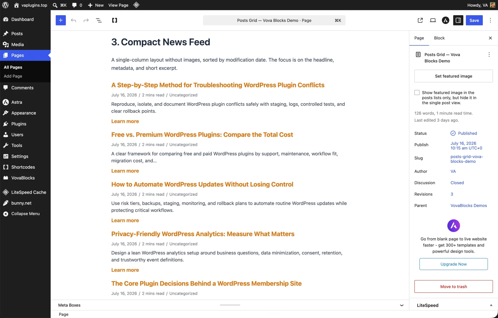
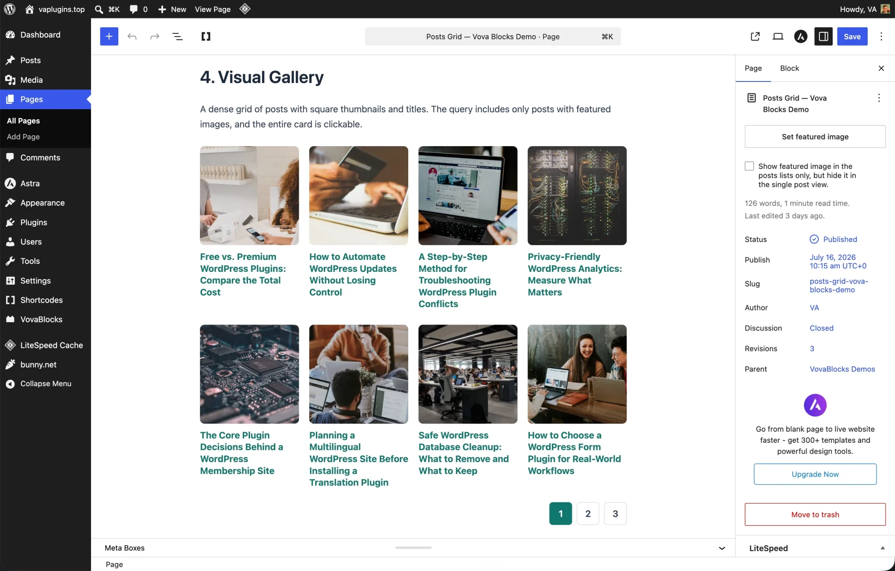
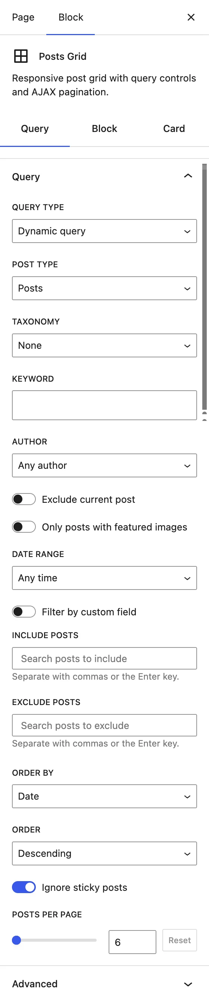
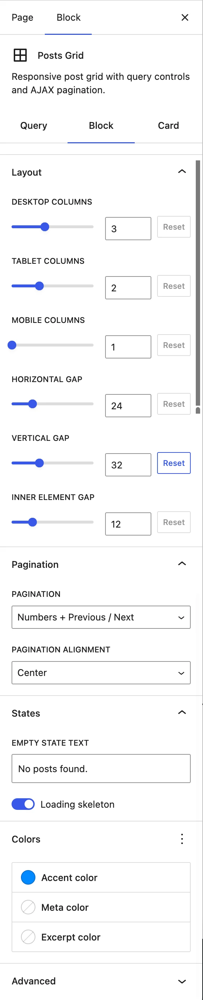
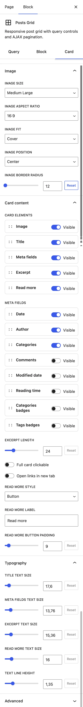

<p align="center">
  <a href="https://vanokhin.github.io/vova-post-grids/">
    
  </a>
</p>

<h1 align="center">Vova's Post Grids</h1>

<p align="center">
  A focused Gutenberg block for flexible queries, responsive layouts, fully customizable cards, and smooth AJAX pagination.
</p>

<p align="center">
  <a href="https://vanokhin.github.io/vova-post-grids/"><strong>Website</strong></a>
  ·
  <a href="https://github.com/vanokhin/vova-post-grids/releases/latest/download/vova-post-grids.zip"><strong>Download latest</strong></a>
  ·
  <a href="https://github.com/vanokhin/vova-post-grids/releases"><strong>Releases</strong></a>
</p>

<p align="center">
  <a href="https://github.com/vanokhin/vova-post-grids/releases/latest"></a>
  <a href="https://wordpress.org/"></a>
  <a href="https://www.php.net/"></a>
  <a href="LICENSE"></a>
</p>

Vova's Post Grids lets you build post grids directly in the WordPress block editor. Query any public post type, hand-pick specific posts, and control every part of the layout without an account, a paid tier, or an external service.

## Highlights

-   **Flexible content queries** — choose a public post type and filter by taxonomy, terms, keyword, author, date range, featured image, or custom field.
-   **Hand-picked collections** — select and order individual posts instead of using a dynamic query.
-   **Responsive layouts** — configure desktop, tablet, and mobile columns independently, along with horizontal and vertical spacing.
-   **Complete card control** — reorder or hide the image, title, metadata, excerpt, and read-more link.
-   **Rich metadata** — display the date, author, categories, comments, modified date, reading time, or badges from a public taxonomy.
-   **Custom styling** — adjust image treatment, typography, colors, spacing, excerpt length, and read-more presentation.
-   **Smooth pagination** — load numbered or previous/next pages in place through the WordPress REST API.
-   **Native WordPress foundation** — built with core editor components, server-side rendering, and WordPress data APIs.

## Screenshots

|                                                Classic grid                                                 |                                                Magazine layout                                                |
| :---------------------------------------------------------------------------------------------------------: | :-----------------------------------------------------------------------------------------------------------: |
| [](docs/screenshots/classic-grid.webp) | [](docs/screenshots/magazine-layout.webp) |
|                                           **Three-column cards**                                            |                                              **Editorial cards**                                              |

|                                                      Compact feed                                                      |                                                     Visual gallery                                                     |
| :--------------------------------------------------------------------------------------------------------------------: | :--------------------------------------------------------------------------------------------------------------------: |
| [](docs/screenshots/compact-news-feed.webp) | [](docs/screenshots/visual-gallery.webp) |
|                                                  **Text-first list**                                                   |                                                  **Image-first grid**                                                  |

<details>
<summary><strong>See all block controls</strong></summary>

|                                              Query                                              |                                               Layout and pagination                                               |                                             Card design                                             |
| :---------------------------------------------------------------------------------------------: | :---------------------------------------------------------------------------------------------------------------: | :-------------------------------------------------------------------------------------------------: |
| [](docs/screenshots/query-controls.webp) | [](docs/screenshots/layout-controls.webp) | [](docs/screenshots/card-controls.webp) |

</details>

## Installation

### Install a release

1. [Download the latest plugin ZIP](https://github.com/vanokhin/vova-post-grids/releases/latest/download/vova-post-grids.zip).
2. In WordPress, go to **Plugins → Add New Plugin → Upload Plugin**.
3. Select the ZIP, install it, and activate **Vova's Post Grids**.
4. Open a post or page in the block editor.
5. Add the **Post Grids** block from the **Vova Post Grids** category.

You can also extract the release into `wp-content/plugins/vova-post-grids` and activate it from the Plugins screen.

> The installable release already contains compiled assets. A source checkout must be built before it can be used as a plugin.

## Using the block

The inspector is organized into three tabs:

1. **Query** — build a dynamic query or choose specific posts, then set filters, ordering, sticky-post behavior, and the number of posts per page.
2. **Block** — configure responsive columns, gaps, pagination, images, empty-state text, and loading skeletons.
3. **Card** — arrange card elements and customize metadata, excerpts, links, typography, and colors.

The block also supports wide and full alignment. When pagination is enabled, only the grid content is updated; the page itself is not reloaded.

## Requirements

| Dependency   | Version                                             |
| ------------ | --------------------------------------------------- |
| WordPress    | 6.5 or later (tested up to 7.0)                     |
| PHP          | 7.4 or later                                        |
| Block editor | Gutenberg-compatible editor included with WordPress |

## Development

Clone the repository and install the JavaScript and PHP development dependencies:

```bash
git clone https://github.com/vanokhin/vova-post-grids.git
cd vova-post-grids
npm ci
composer install
```

The production build also regenerates the translation template, so make sure [WP-CLI](https://wp-cli.org/) and its `i18n` command are available.

| Command                | Purpose                                                    |
| ---------------------- | ---------------------------------------------------------- |
| `npm start`            | Start the development build in watch mode                  |
| `npm run build`        | Compile production assets and regenerate the POT file      |
| `npm run lint:js`      | Lint JavaScript                                            |
| `npm run lint:css`     | Lint stylesheets                                           |
| `npm run lint:php`     | Check WordPress coding standards and PHP 7.4 compatibility |
| `npm run format:check` | Check formatting without changing files                    |
| `npm run test:unit`    | Run JavaScript unit tests                                  |
| `npm run export`       | Build and create a verified release ZIP in `dist/`         |

### Project structure

```text
vova-post-grids.php              Plugin bootstrap and block registration
includes/                        Server-side queries, rendering, and REST endpoint
src/blocks/post-grids/           Block metadata, editor UI, styles, and front-end script
src/shared/                      Shared editor components and styles
languages/                       Translation template
scripts/                         Reproducible release tooling
docs/                            GitHub Pages website and screenshots
```

Release tags are expected to match the version in `package.json`. See [docs/PUBLISHING.md](docs/PUBLISHING.md) for the complete publishing workflow.

## Frequently asked questions

### Which content can the block display?

Any public post type and its public taxonomies, or a hand-picked list of specific posts.

### Does pagination reload the whole page?

No. The selected page is loaded through the WordPress REST API and the grid is updated in place.

### Does the plugin connect to an external service?

No. It works entirely with the content and APIs of the WordPress site where it is installed.

### Can I use it on a commercial website?

Yes. The plugin is free software licensed under GPL-2.0-or-later.

## License

Copyright © Vova Anokhin. Licensed under the [GNU General Public License v2.0 or later](LICENSE).
